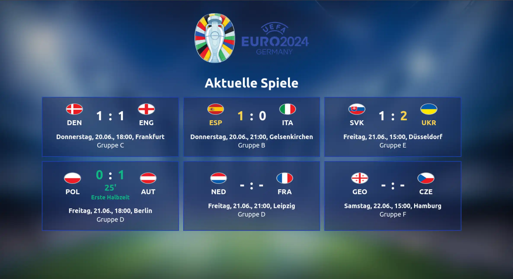

# UEFA EURO 2024 Infoscreen

> [!WARNING]
> Dieses Projekt ist archiviert. Änderungen, Issues etc. sind nicht erwünscht.
> Der Code ist lediglich open-sourced für Interessierte um ähnliche Anwendungen zu erstellen.

Infobildschirm Web-App zur Anzeige von aktuellen Spielen und Ergebnissen der UEFA EURO 2024.
Die Daten werden von der offiziellen UEFA API bezogen.

## Build
1. `npm install`
2. `npm run build`
3. Deployment der Dateien im `dist`-Ordner

## Development
1. `npm install`
2. `npm run dev`
3. <http://localhost:5173> im Browser öffnen

## Lizenz

Das UEFA EURO Logo steht unter dem Urheberrecht der UEFA und wird hier nur zu Informationszwecken verwendet.

Das Hintergrundbild steht unter der CC0-Lizenz.

Der Rest des Codes steht unter der MIT-Lizenz.
